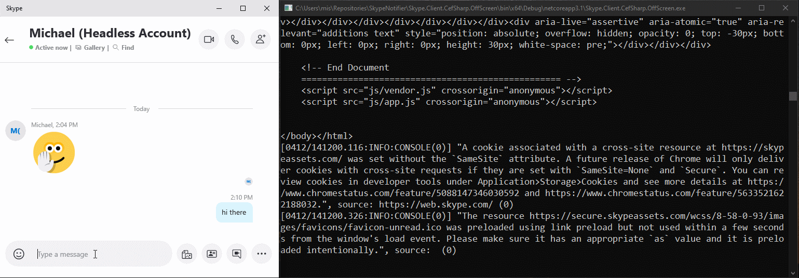

# SkypeNotifier
Skype Notifier consist of a comple of libraries that eventually team up to send notifications about incoming Skype calls to other devices like an Arduino/ESP32/ESP8266.

**Current Status**  
✔️ Login and recieve notifications on a console or WPF application  
✔️ Code split for reusability with minimal dependencies  

**Pending**  
💡 Forward notifications to listener device  
💡 Wrapper to hide heavy dependencies to CefSharp

## Demo
In the current state the application provides console output for incoming messages and calls, as seen below

The shown demo can be found in `Skype.Client.Demo` project

## Acknowledgements
This project is based on 
* Newtonsoft Json.NET (MIT)
* CEFSharp (BSD)
